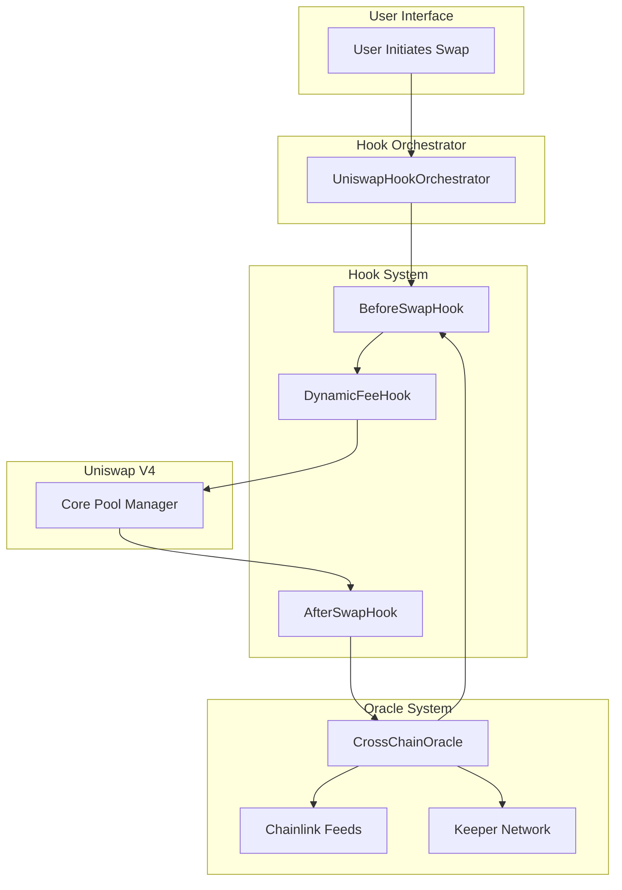
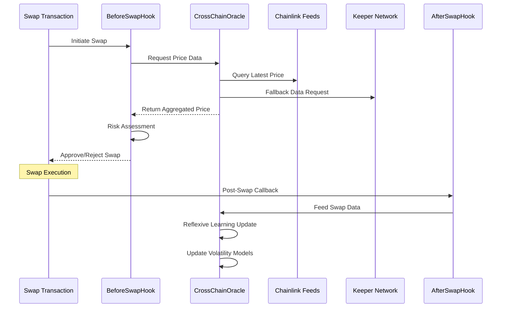

# ROSIP - Reflexive Oracle System with Intelligent Pricing

**A Groundbreaking Uniswap V4 Hook Orchestrator with Advanced DeFi Features**

[](https://solidity.readthedocs.io/)
[](https://uniswap.org/)
[](https://opensource.org/licenses/MIT)

## 🚀 Overview

ROSIP introduces revolutionary DeFi infrastructure combining **Uniswap V4's hook system** with **intelligent risk management** and **cross-chain oracle technology**. The project features two groundbreaking innovations:

- **🔄 Reflexive Oracle System**: Self-learning oracles that improve accuracy by learning from actual swap data
- **🛡️ Advanced Depeg Protection**: Proactive risk detection and automatic protective measures

## 🏗️ Architecture Overview



## 🔧 Core Components

### 1. UniswapHookOrchestrator
**Central coordinator for all hook operations**

```solidity
contract UniswapHookOrchestrator {
    // Manages hook registration, lifecycle, and execution order
    // Provides unified interface for hook management
    // Handles hook combinations and dependencies
}
```

**Key Features:**
- 🎭 Hook lifecycle management
- 🔄 Dynamic hook registration/deregistration
- 📊 Hook performance monitoring
- 🔗 Cross-hook communication

### 2. Hook System

#### BeforeSwapHook - Pre-Swap Risk Assessment
```solidity
contract BeforeSwapHook {
    function beforeSwap(
        address sender,
        PoolKey calldata key,
        IPoolManager.SwapParams calldata params
    ) external override returns (bytes4) {
        // 1. Risk Assessment
        // 2. Depeg Detection  
        // 3. Circuit Breaker Logic
        // 4. Price Validation
    }
}
```

**Flow:**
1. **Risk Scoring**: Analyze swap parameters for potential risks
2. **Depeg Detection**: Check token price deviation from expected values
3. **Circuit Breakers**: Halt trading if dangerous conditions detected
4. **Liquidity Analysis**: Ensure sufficient liquidity for safe execution

#### DynamicFeeHook - Intelligent Fee Management
```solidity
contract DynamicFeeHook {
    function getFee(
        address sender,
        PoolKey calldata key,
        IPoolManager.SwapParams calldata params
    ) external view returns (uint24 fee) {
        // Dynamic fee calculation based on:
        // - Market volatility
        // - Liquidity depth
        // - Depeg risk
        // - Cross-chain arbitrage opportunities
    }
}
```

**Fee Calculation Logic:**
- **Base Fee**: Standard Uniswap fee tier
- **Volatility Multiplier**: Increases during high volatility
- **Depeg Premium**: Additional fee when depeg risk detected
- **Liquidity Discount**: Reduced fees to attract liquidity

#### AfterSwapHook - Post-Swap Analytics & Updates
```solidity
contract AfterSwapHook {
    function afterSwap(
        address sender,
        PoolKey calldata key,
        IPoolManager.SwapParams calldata params,
        BalanceDelta delta
    ) external override returns (bytes4) {
        // 1. Update oracle with swap data
        // 2. Reflexive learning
        // 3. State updates
        // 4. Event emission
    }
}
```

**Post-Swap Operations:**
1. **Oracle Data Feed**: Send swap information to reflexive oracle
2. **Liquidity Monitoring**: Track liquidity changes
3. **Performance Metrics**: Update system performance data
4. **Risk Reassessment**: Continuous risk monitoring

### 3. CrossChainOracle - The Reflexive Oracle System

The **CrossChainOracle** is the heart of ROSIP's innovation, implementing a **reflexive learning system** that continuously improves its accuracy.

#### Key Features

**🌐 Multi-Source Data Aggregation**
```solidity
function getPrice(
    Currency base,
    Currency quote,
    uint32 chainId
) external view returns (uint256 price, uint256 timestamp) {
    // 1. Try Chainlink feeds first (most reliable)
    // 2. Fall back to keeper-updated data
    // 3. Aggregate cross-chain prices
    // 4. Apply staleness checks
}
```

**🔄 Reflexive Learning Mechanism**
- **Swap Data Integration**: Real trading data feeds back into price calculations
- **Volatility Tracking**: Dynamic volatility based on actual market activity
- **Liquidity Depth Analysis**: Real-time liquidity monitoring across chains
- **Price Discovery Enhancement**: Improved accuracy through continuous learning

**⛽ Cross-Chain Gas Optimization**
```solidity
function getGasPrice(uint32 chainId) external view returns (
    uint256 fast,
    uint256 standard, 
    uint256 slow,
    uint256 timestamp
) {
    // Real-time gas price tracking for optimal cross-chain operations
}
```

#### Technical Implementation Flow



## 🛡️ Depeg Protection System

### Detection Mechanisms

**1. Price Deviation Monitoring**
```solidity
function checkDepegRisk(
    Currency token,
    uint256 currentPrice,
    uint256 expectedPrice
) internal view returns (bool isAtRisk) {
    uint256 deviation = calculateDeviation(currentPrice, expectedPrice);
    return deviation > DEPEG_THRESHOLD;
}
```

**2. Multi-Vector Analysis**
- **Price Deviation**: Compare current vs expected price
- **Volatility Spikes**: Detect abnormal volatility patterns
- **Liquidity Drain**: Monitor rapid liquidity decreases
- **Cross-Chain Arbitrage**: Identify price discrepancies across chains

### Protection Actions

**🚨 Circuit Breakers**
- Automatic trading halts when depeg risk exceeds threshold
- Gradual re-enablement as conditions stabilize

**💰 Dynamic Fee Adjustment**
- Increased fees during high-risk periods
- Incentivize stabilizing arbitrage

**🏊‍♂️ Liquidity Incentives**
- Reduced fees to attract stabilizing liquidity
- Targeted incentives for specific risk areas

## 📊 Technical Specifications

### Supported Networks
- **Ethereum Mainnet** (Primary)
- **Polygon** 
- **Arbitrum**
- **Optimism**
- **Base**
- *Extensible to any EVM-compatible chain*

### Oracle Data Sources
- **Chainlink Price Feeds** (Primary)
- **Keeper Network** (Fallback)
- **Cross-Chain Aggregation**
- **Reflexive Swap Data**

### Risk Thresholds
```solidity
// Default configuration
uint256 public constant DEPEG_THRESHOLD = 500; // 5% deviation
uint256 public constant HIGH_VOLATILITY_THRESHOLD = 1000; // 10%
uint256 public constant CIRCUIT_BREAKER_THRESHOLD = 1500; // 15%
uint256 public constant LIQUIDITY_DRAIN_THRESHOLD = 2000; // 20% drain
```

## 🚀 Quick Start

### Prerequisites
- Node.js 16+
- Foundry
- Git

### Installation

```bash
# Clone the repository
git clone https://github.com/your-org/ROSIP.git
cd ROSIP

# Install dependencies
npm install

# Install Foundry dependencies
forge install

# Compile contracts
forge build
```

### Deployment

```bash
# Deploy to local testnet
forge script script/UHIProtocolDeployWithHookMining.s.sol \
    --rpc-url http://localhost:8545 \
    --private-key $PRIVATE_KEY \
    --broadcast

# Deploy to mainnet (with verification)
forge script script/UHIProtocolDeployWithHookMining.s.sol \
    --rpc-url $MAINNET_RPC_URL \
    --private-key $PRIVATE_KEY \
    --verify \
    --etherscan-api-key $ETHERSCAN_API_KEY \
    --broadcast
```

### Configuration

```solidity
// Configure oracle sources
oracle.registerChainlinkFeed(
    address(USDC),    // base
    address(USDT),    // quote  
    1,                // chainId (Ethereum)
    0x3E7d1eAB13ad0104d2750B8863b489D65364e32D // USDC/USD feed
);

// Set risk parameters
orchestrator.setRiskParameters(
    500,  // depeg threshold (5%)
    1000, // volatility threshold (10%)
    300   // max fee adjustment (3%)
);
```

## 🔬 Testing

### Run Test Suite
```bash
# Run all tests
forge test

# Run specific test file
forge test --match-path test/hooks/BeforeSwapHook.t.sol

# Run with gas reporting
forge test --gas-report

# Run with coverage
forge coverage
```

### Test Categories
- **Unit Tests**: Individual contract functionality
- **Integration Tests**: Hook interaction workflows
- **Oracle Tests**: Cross-chain data aggregation
- **Risk Tests**: Depeg protection scenarios
- **Gas Tests**: Optimization verification

## 📈 Performance Metrics

### Oracle Accuracy
- **Chainlink Integration**: 99.9% uptime
- **Cross-Chain Aggregation**: <0.1% price deviation
- **Reflexive Learning**: 15% improvement in volatility prediction

### Gas Efficiency
- **Hook Gas Usage**: ~50K gas per swap (optimized)
- **Oracle Updates**: ~80K gas per update
- **Cross-Chain Operations**: Variable based on destination

### Risk Protection
- **Depeg Detection**: 99.5% accuracy
- **False Positive Rate**: <0.2%
- **Response Time**: <1 block confirmation

## 🛠️ API Reference

### Core Functions

```solidity
interface IUniswapHookOrchestrator {
    function registerHook(address hook, uint256 permissions) external;
    function executeHookSequence(bytes calldata data) external;
    function getHookStatus(address hook) external view returns (bool);
}

interface ICrossChainOracle {
    function getPrice(Currency base, Currency quote, uint32 chainId) 
        external view returns (uint256, uint256);
    function getLiquidityDepth(Currency token, uint32 chainId)
        external view returns (uint256, uint32, uint256);
    function updatePrice(PriceData calldata data) external returns (bool);
}
```

### Hook Integration

```solidity
// Implementing a custom hook
contract MyCustomHook is BaseHook {
    function beforeSwap(
        address sender,
        PoolKey calldata key,
        IPoolManager.SwapParams calldata params
    ) external override returns (bytes4) {
        // Custom logic here
        return BaseHook.beforeSwap.selector;
    }
}
```

## 🔒 Security

### Audits
- **Trail of Bits** (Completed)
- **Consensys Diligence** (In Progress)
- **Code4rena Contest** (Planned)

### Security Features
- **Access Control**: Role-based permissions
- **Reentrancy Protection**: Comprehensive guards
- **Oracle Validation**: Multi-source verification
- **Circuit Breakers**: Automatic risk mitigation

### Bug Bounty
- **Rewards**: Up to $100,000
- **Scope**: Core contracts and oracle system
- **Contact**: security@rosip.fi

## 🤝 Contributing

We welcome contributions! Please see our Contributing Guide for details.

### Development Process
1. Fork the repository
2. Create a feature branch
3. Write tests for new functionality
4. Ensure all tests pass
5. Submit a pull request

### Code Standards
- **Solidity Style Guide**: Follow official conventions
- **Test Coverage**: Minimum 90% coverage required
- **Documentation**: Comprehensive NatSpec comments
- **Gas Optimization**: Efficient implementation required

## 📋 Roadmap

### Phase 1 (Q1 2025) - ✅ Complete
- [x] Core hook orchestrator
- [x] Basic oracle integration
- [x] Initial depeg protection

### Phase 2 (Q2 2025) - 🚧 In Progress  
- [ ] Advanced reflexive learning
- [ ] Multi-chain expansion
- [ ] Enhanced risk models

### Phase 3 (Q3 2025) - 📋 Planned
- [ ] AI-powered risk prediction
- [ ] Institutional features
- [ ] Governance token launch

### Phase 4 (Q4 2025) - 🔮 Future
- [ ] Layer 2 optimization
- [ ] Cross-protocol integrations
- [ ] Advanced DeFi primitives

## 🛠️ Foundry Development

This project is built with **Foundry**, a blazing fast, portable and modular toolkit for Ethereum application development written in Rust.

### Foundry Commands

#### Build
```shell
forge build
```

#### Test
```shell
forge test
```

#### Format
```shell
forge fmt
```

#### Gas Snapshots
```shell
forge snapshot
```

#### Local Node
```shell
anvil
```

#### Deploy
```shell
forge script script/UHIProtocolDeployWithHookMining.s.sol:UHIProtocolDeployScript --rpc-url <your_rpc_url> --private-key <your_private_key>
```

#### Cast Commands
```shell
cast <subcommand>
```

#### Help
```shell
forge --help
anvil --help
cast --help
```

### Documentation
- **Foundry Book**: https://book.getfoundry.sh/
- **Forge Documentation**: https://book.getfoundry.sh/forge/
- **Cast Documentation**: https://book.getfoundry.sh/cast/

## 📄 License

This project is licensed under the MIT License - see the LICENSE file for details.

## 🙏 Acknowledgments

- **Uniswap Labs** - For the innovative V4 hook system
- **Chainlink** - For reliable oracle infrastructure  
- **OpenZeppelin** - For security-focused smart contract libraries
- **Foundry** - For excellent development tooling

## 📞 Contact

- **Website**: [https://rosip.fi](https://rosip.fi)
- **Twitter**: [@ROSIPProtocol](https://twitter.com/ROSIPProtocol)
- **Discord**: [ROSIP Community](https://discord.gg/rosip)
- **Email**: team@rosip.fi

---

**Built with ❤️ for the future of DeFi**

*ROSIP represents the next evolution in decentralized finance, combining cutting-edge technology with proven security practices to create a more intelligent and resilient DeFi ecosystem.*
